# Job Marketplace Frontend

##### [Live Demo](https://job-pulse.netlify.app/) on Netlify

## 📷 Screenshot

<p align="center">
  <a href="https://job-pulse.netlify.app/" target="_blank">
    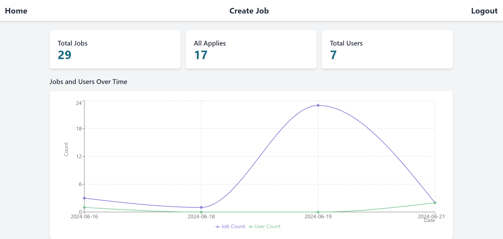
  </a>
</p>

## 📋 Project Description

This React-based frontend application serves as the interface for a job marketplace platform. Users can register, login, manage profiles, create job listings, apply for jobs, receive notifications, and manage roles through an admin panel. The application provides a seamless user experience with modern design and animations.

---

## 💻 Technologies Used

- **React**: A JavaScript library for building user interfaces.
- **Tailwind CSS**: A utility-first CSS framework for rapid UI development.
- **Vite**: A next-generation frontend tooling for fast development and build.

## 🚀 Getting Started

### Prerequisites

Ensure you have the following installed:

- Node.js (v20.11.1 or higher)
- npm (Node Package Manager)

### Installation

1. Clone the repository:

   ```sh
   git clone https://github.com/Durgaprasd25d/job-finding-app.git
   cd job-finding-app
   ```

2. Install dependencies:

   ```sh
   npm install
   ```

3. Start the development server:

   ```sh
   npm run dev
   ```

4. Open your browser and navigate to:

   ```
   http://localhost:5173
   ```

## 📦 Available Scripts

In the project directory, you can run:

### `npm run dev`

Runs the app in the development mode with Vite. Open [http://localhost:5173](http://localhost:5173) to view it in the browser.

### `npm run build`

Builds the app for production to the `dist` folder.

### `npm run preview`

Locally preview the production build.

## ✨ Features

- User registration and authentication
- Profile management
- Job listing creation and management
- Job application functionality
- Admin panel for managing user roles for job posting and CRUD operations with jobs and can update job applications

## 🖼️ Images

### Admin Panel

<p align="center">
  
</p>

<p align="center">
  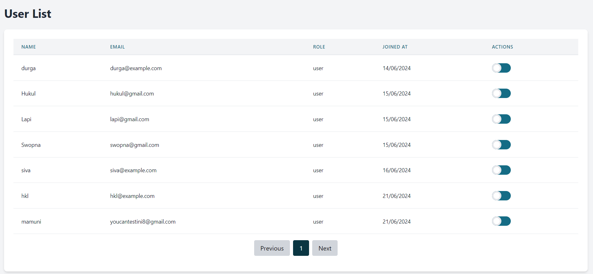
</p>

<p align="center">
  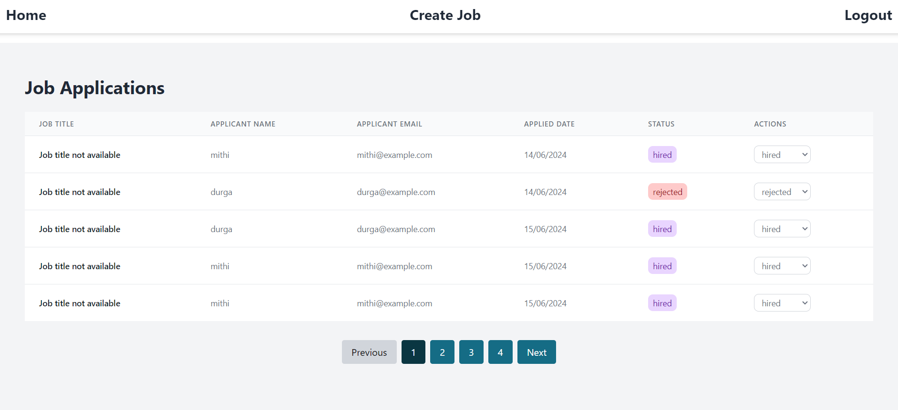
</p>

<p align="center">
  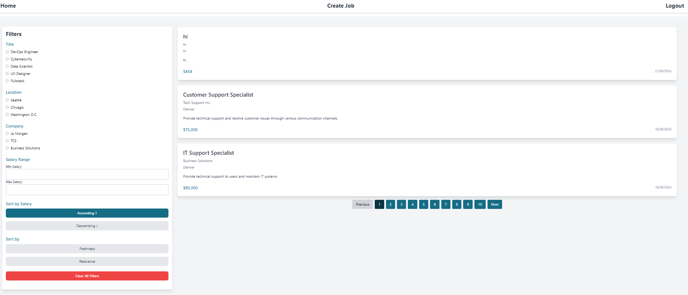
</p>

### Frontend

<p align="center">
  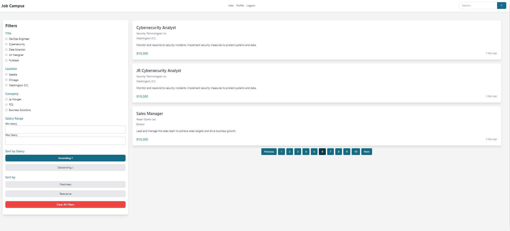
</p>

<p align="center">
  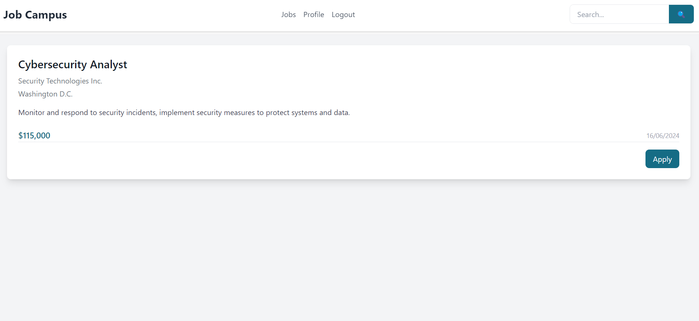
</p>

<p align="center">
  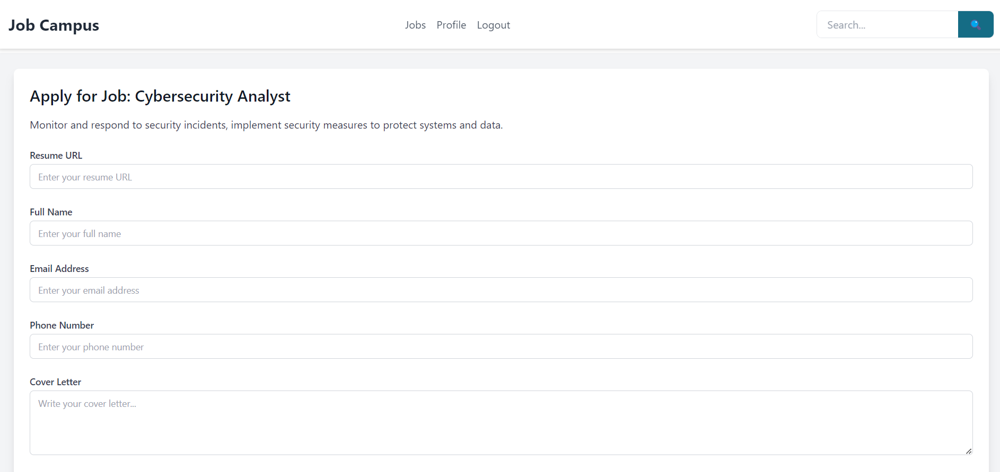
</p>

<p align="center">
  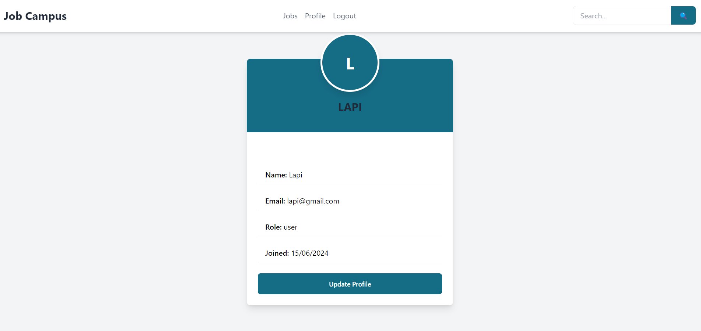
</p>

<p align="center">
  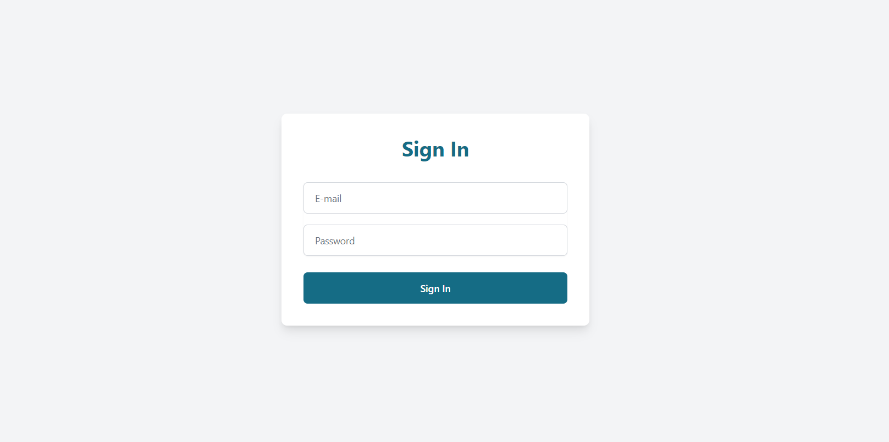
</p>

## 🛠️ System Design

### Backend

<p align="center">
  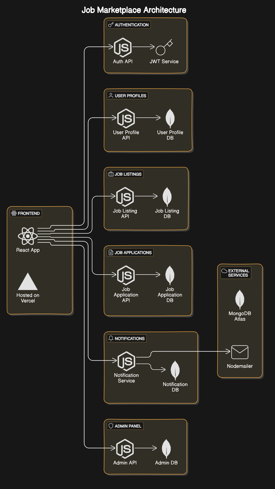
</p>

### Frontend

<p align="center">
  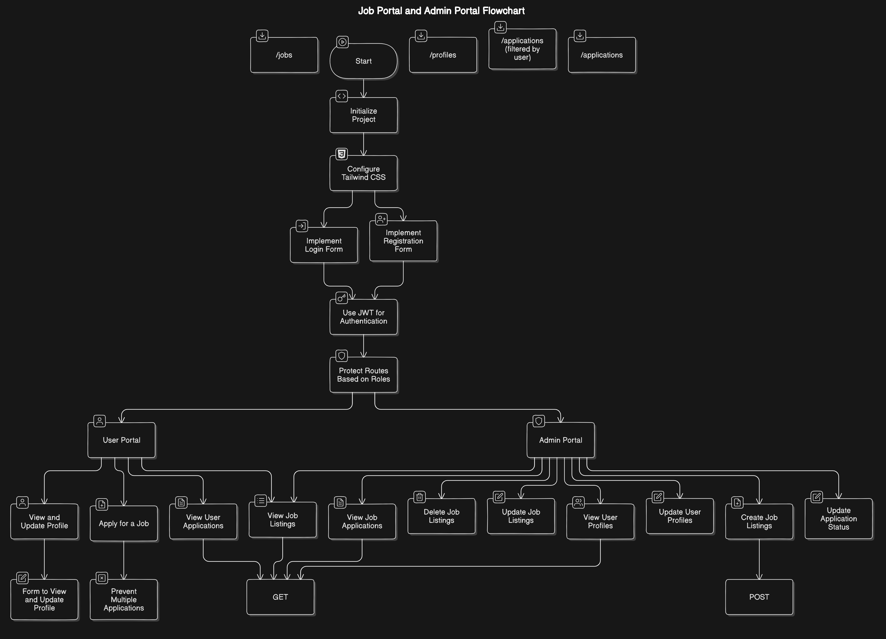
</p>

## 📜 License

This project is licensed under the MIT License.

---

Developed by [Durgaprasad Dalai](https://talent-durga.netlify.app/)
